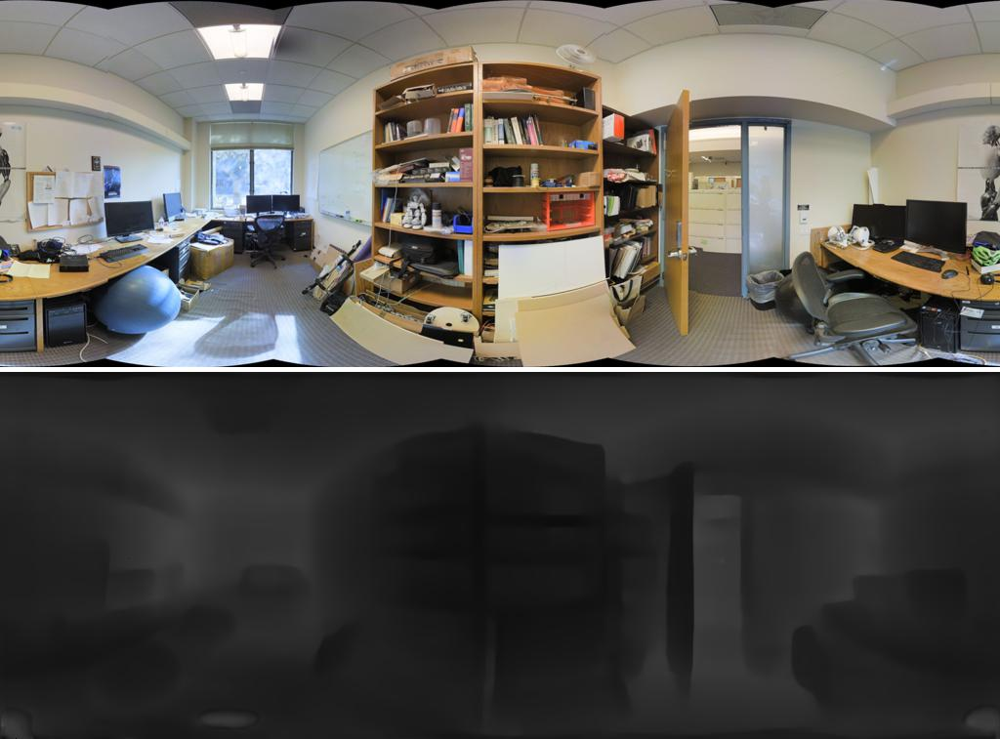

# HiMODE

#### Requirements of Run this Code
```
pip install -r requirements.txt
```

## How to run this code...
First clone our repo:
```
git clone https://github.com/himode5008/HiMODE.git
cd HiMODE
```
### Steps: (1)
Download the HiMODE weight [HiMODE Weight](https://drive.google.com/drive/folders/1fEyLYSy_V6YFmUx7OZH4bSvf4UZGLlAQ?usp=sharing) and create a **model** folder:

then put the ```HiMODE_trained.pkl``` into **model** folder.
### Steps: (2)
**Result** folder has contained a ```any.jpg``` RGB image as an example. <br> 
If you want to test your own image, please put your own images into **Result** folder, Then, run this himode.py file:
```
python himode.py
```

After that, the results will be show in this **Result** folder! <br>
+ Here is the example of some images
<p float="left">
  
  
  
</p>

<p float="left">
  
  
  
</p>

<p float="left">
  
  
  
</p>


The Restuls are consisted of ```Both.jpg```, ```Depth.jpg```, and ```Lout.npy```. <br>
+ Here
```Both.jpg``` is the input and output depth image. <br>
```Depth.jpg``` is the depth map. <br>
```Lout.npy``` is the data of input and output value. <br>
